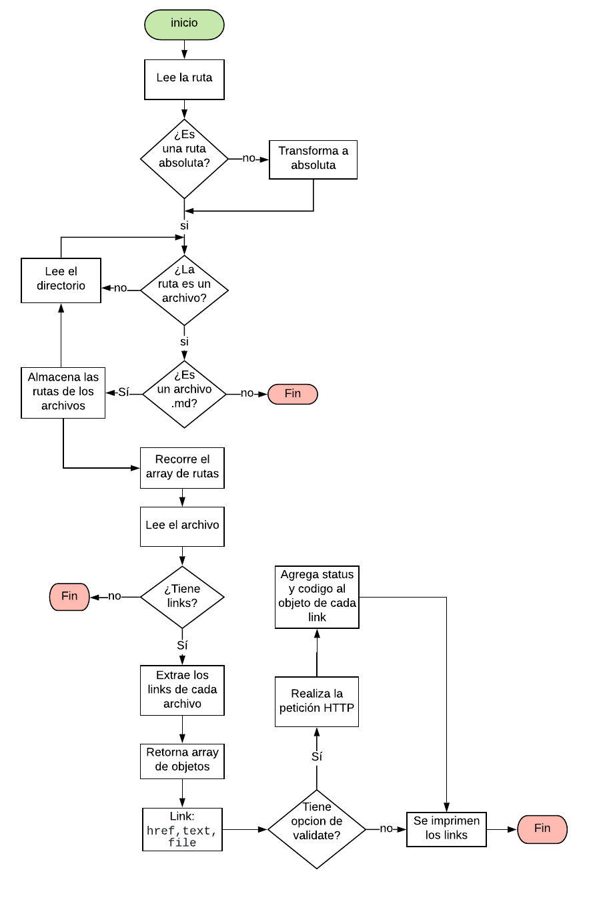
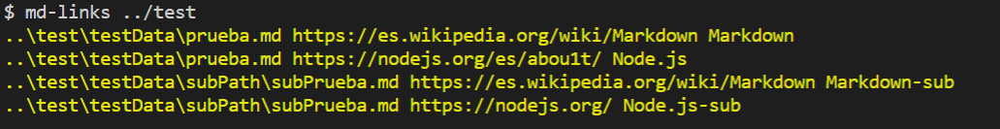
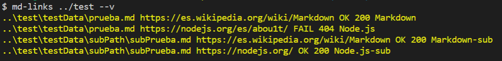
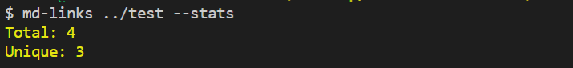
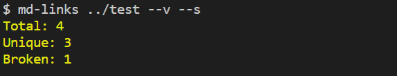

# Markdown Links

  

## Preámbulo

  [Markdown](https://es.wikipedia.org/wiki/Markdown) es un lenguaje de marcado ligero muy popular entre developers. Es usado en muchísimas plataformas que manejan texto plano (GitHub, foros, blogs, ...), y es muy común encontrar varios archivos en ese formato en cualquier tipo de repositorio (ejemplo el tradicional `README.md`).

Estos archivos `Markdown` normalmente contienen _links_ vínculos/ligas) que muchas veces están rotos o ya no son válidos y eso perjudica mucho el valor de la información que se quiere compartir.

Dentro de una comunidad de código abierto, nos han propuesto crear una herramienta usando [Node.js](https://nodejs.org/), que lea y analice archivos en formato `Markdown`, para verificar los links que contengan y reportar algunas estadísticas.

  

## Diagrama de Flujo 
 

## Implementación

  ### Api `mdLinks(path, options)`
  #### Argumentos
  -   `path`: Ruta absoluta o relativa al archivo o directorio. 
  -   `options`: Un objeto con las siguientes propiedades:
	    -   `validate`: Booleano que determina si se desea validar los links encontrados.
#### Uso
- Para usar la librería debe importar el modulo de la siguiente manera:
    ```js
    const  mdLinks  =  require('@Jesseliz/md-links');
   ```
 - Para validar el modulo con la opción de validación considere true como argumento.
	 ```js
    mdLinks.mdLinks('src', {validate: true}).then((resolve) =>  console.log(resolve));
   ```
#### Valor de retorno
La función retorna una promesa (`Promise`) que resuelva a un arreglo (`Array`) de objetos (`Object`), donde cada objeto representa un link y contiene las siguientes propiedades:
-   `href`: URL encontrada.
-   `text`: Texto que aparecía dentro del link (`<a>`).
-   `file`: Ruta del archivo donde se encontró el link.

Si se considera la opción de validación de links se agregaran dos propiedades más que incluye la palabra `ok` o `fail` después de la URL, así como el status de la respuesta recibida a la petición HTTP a dicha URL.

```js
const mdLinks = require("md-links");

mdLinks("./some/example.md")
  .then(links => {
    // => [{ href, text, file }]
  })
  .catch(console.error);

mdLinks("./some/example.md", { validate: true })
  .then(links => {
    // => [{ href, text, file, status, ok }]
  })
  .catch(console.error);

mdLinks("./some/dir")
  .then(links => {
    // => [{ href, text, file }]
  })
  .catch(console.error);
```
	    
## Documentación Técnica
Para ejecutar la aplicación debe escribir la siguiente linea de comandos a través de la terminal:
`md-links <path-to-file> [options]`

por ejemplo:



El comportamiento por defecto no valida si las URLs responden ok o no, solo identifica el archivo markdown (a partir de la ruta que recibe como argumento), analiza el archivo Markdown e imprime los links que vaya encontrando, junto con la ruta del archivo donde se encontraron y el texto que hay dentro del link (truncado a 50 caracteres).

### Options

#### `--validate`

Si pasamos la opción  `--validate`, `--v` o `v`, el módulo hace una petición HTTP para averiguar si el link funciona o no. Si el link resulta en una redirección a una URL que responde ok, entonces considera el link como ok.

Por ejemplo:



Vemos que el _output_ en este caso incluye la palabra `ok` o `fail` después de la URL, así como el status de la respuesta recibida a la petición HTTP a dicha URL.

#### `--stats`
Si pasamos la opción  `--stats` , `--s`  o `s` el output (salida) será un texto con estadísticas básicas sobre los links.

Por ejemplo:



#### `--stats y --validate`
También podemos combinar ambas opciones  `--stats`  y  `--validate`  para obtener estadísticas que necesiten de los resultados de la validación.

Por ejemplo:



## Instalación 

- Para instalar la libreria vía npm ejecutar la siguiente linea a través de la terminal:
  `npm install Jesseliz/md-links`  :wink:
  

 ## Objetivos de aprendizaje
 
### Objetivos de aprendizaje pendientes
- [x] Creación y consumo de promesas

### Javascript
- [ ] Uso de callbacks
- [x] Consumo de Promesas
- [x] Creacion de Promesas
- [x] Modulos de Js
- [x] Recursión

### Node
- [x] Sistema de archivos
- [x] package.json
- [x] crear modules
- [x] Instalar y usar modules
- [ ] npm scripts
- [x] CLI (Command Line Interface - Interfaz de Línea de Comando)

### Testing
- [x] Testeo de tus funciones
- [x] Testeo asíncrono
- [ ] Uso de librerias de Mock
- [x] Testeo para multiples Sistemas Operativos

### Buenas prácticas de desarrollo
- [x] Modularización
- [x] Nomenclatura / Semántica
- [x] Linting

***

### Tutoriales / NodeSchool workshoppers
- [learnyounode](https://github.com/workshopper/learnyounode)
- [how-to-npm](https://github.com/workshopper/how-to-npm)
- [promise-it-wont-hurt](https://github.com/stevekane/promise-it-wont-hurt)

### Otros recursos
- [Acerca de Node.js - Documentación oficial](https://nodejs.org/es/about/)
- [Node.js file system - Documentación oficial](https://nodejs.org/api/fs.html)
- [Node.js http.get - Documentación oficial](https://nodejs.org/api/http.html#http_http_get_options_callback)
- [Node.js - Wikipedia](https://es.wikipedia.org/wiki/Node.js)
- [What exactly is Node.js? - freeCodeCamp](https://medium.freecodecamp.org/what-exactly-is-node-js-ae36e97449f5)
- [¿Qué es Node.js y para qué sirve? - drauta.com](https://www.drauta.com/que-es-nodejs-y-para-que-sirve)
- [¿Qué es Nodejs? Javascript en el Servidor - Fazt en YouTube](https://www.youtube.com/watch?v=WgSc1nv_4Gw)
- [¿Simplemente qué es Node.js? - IBM Developer Works, 2011](https://www.ibm.com/developerworks/ssa/opensource/library/os-nodejs/index.html)
- [Node.js y npm](https://www.genbeta.com/desarrollo/node-js-y-npm)
- [Módulos, librerías, paquetes, frameworks... ¿cuál es la diferencia?](http://community.laboratoria.la/t/modulos-librerias-paquetes-frameworks-cual-es-la-diferencia/175)
- [Asíncronía en js](https://carlosazaustre.com/manejando-la-asincronia-en-javascript/)
- [NPM](https://docs.npmjs.com/getting-started/what-is-npm)
- [Publicar packpage](https://docs.npmjs.com/getting-started/publishing-npm-packages)
- [Crear módulos en Node.js](https://docs.npmjs.com/getting-started/publishing-npm-packages)
- [Leer un archivo](https://nodejs.org/api/fs.html#fs_fs_readfile_path_options_callback)
- [Leer un directorio](https://nodejs.org/api/fs.html#fs_fs_readdir_path_options_callback)
- [Path](https://nodejs.org/api/path.html)
- [Linea de comando CLI](https://medium.com/netscape/a-guide-to-create-a-nodejs-command-line-package-c2166ad0452e)
- [Promise](https://javascript.info/promise-basics)
- [Comprendiendo Promesas en Js](https://hackernoon.com/understanding-promises-in-javascript-13d99df067c1)
- [Pill de recursión - video](https://www.youtube.com/watch?v=lPPgY3HLlhQ&t=916s)
- [Pill de recursión - repositorio](https://github.com/merunga/pildora-recursion)
